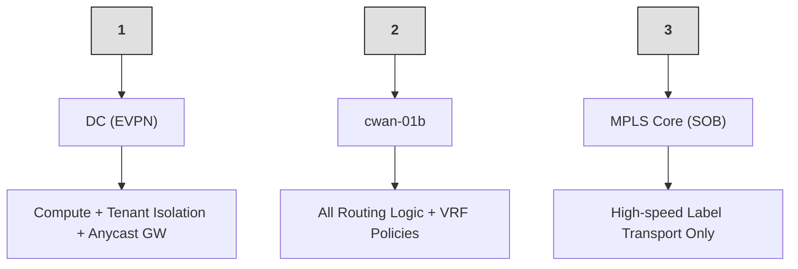
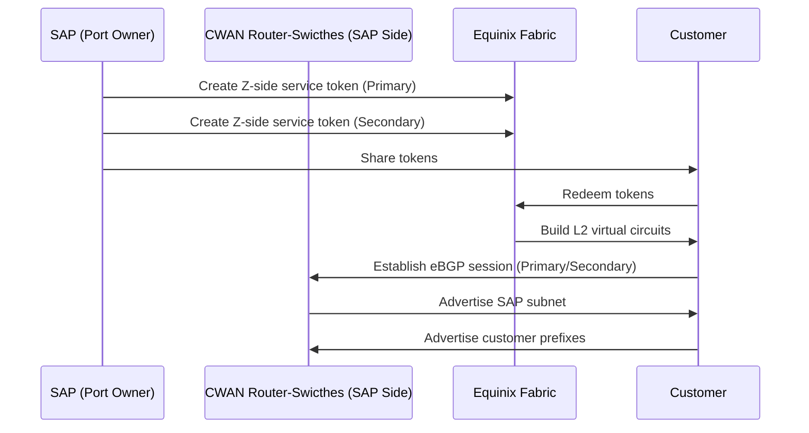

## Summary
This document provides the complete reference architecture and a concrete runbook for SAP(IaaS) Cloud Peering service connectivity

# Cloud Peering
The cloud pairing is a simple plug & play service which is equivalent to the the direct connect from AWS or maybe express route from Azure or maybe the Google Cloud interconnect from GCP. Example: interconnection ecosystem providers like Equinix and MegaPort.

SAP has cloud peering connection which doesn’t require any physical link of the cable or devices. If customer has any internet connectivity from any Internet Service Provider i.e Equinix, Megaport, Verizon, etc… SAP would be able to connect virtually and provide cloud peering connection.

The difference between MPLS and cloud peering is that both provide private or dedicated connectivity solutions for customers. However, the key difference is that with MPLS, the customer can bring their own device and connect the circuit end‑to‑end directly with the service provider, while cloud peering does not involve customer‑managed end‑to‑end circuits in the same way.

Goal:
On-prem network  ⇄  SAP HEC application subnet

# Architecture Model

There is a 3‑Domain Model:

### (1) Data Center Fabric (EVPN/VXLAN)
- Hosts workloads (HEC/S4/HANA)  
- Uses Anycast Gateway (10.x.x.1)  
- EVPN Type‑5 advertises SAP subnet prefixes  
- Fast east‑west movement inside DC  

### (2) WAN/VPN Edge (CWAN)
- Terminates customer Cloud Peering  
- VRF CUSTOMER_0XXX  
- Converts EVPN Type‑5 → VPNv4  
- Attaches PRIO communities  
- Adds Local‑Pref or AS‑Path prepend  

### (3) SAP ONE Backbone (MPLS Transport)
- Pure transport layer (PE → P → PE)  
- No routing policy  
- No VRF decisions in P nodes  
- Moves VRF traffic using labels 



# Architecture Overview

```mermaid

flowchart LR

%% ===========================
%% Global Styling for Big Diagram
%% ===========================
classDef big stroke-width:4px, font-size:22px, padding:25px;

classDef customer fill:#4DA3FF,stroke:#005B99,color:#fff,stroke-width:4px,font-size:22px,padding:25px;
classDef telco fill:#A6A6A6,stroke:#4D4D4D,color:#fff,stroke-width:4px,font-size:22px,padding:25px;
classDef interco fill:#B3E6FF,stroke:#0099CC,color:#000,stroke-width:4px,font-size:22px,padding:25px;
classDef qinq fill:#FFD480,stroke:#CC8E00,color:#000,stroke-width:4px,font-size:22px,padding:25px;
classDef sap fill:#F28585,stroke:#993333,color:#000,stroke-width:4px,font-size:22px,padding:25px;
classDef cwan fill:#D5B3FF,stroke:#6A4D99,color:#000,stroke-width:4px,font-size:22px,padding:25px;
classDef core fill:#8FD9A8,stroke:#3F8F5E,color:#000,stroke-width:4px,font-size:22px,padding:25px;

linkStyle default stroke-width:4px;

%% ================================================================
%% VLAN 100 → 401   AND   VLAN 200 → 501  (Horizontal view)
%% ================================================================

%% LEFT: CUSTOMER
H1[CUSTOMER HOST
C‑VLAN 100]:::customer
H2[CUSTOMER HOST
C‑VLAN 200]:::customer

H1 --> CE1[CE1
Customer Edge]:::customer
H2 --> CE2[CE2
Customer Edge]:::customer

%% TELCO
CE1 --> DT1[Deutsche Telekom_PE1
L2/L3 Handoff]:::telco
CE2 --> DT2[Deutsche Telekom_PE2
L2/L3 Handoff]:::telco

%% INTERCONNECT Dual-Homed
DT1 --> EQ1[Equinix_PE1
Fabric Port‑1]:::interco
DT2 --> EQ2[Equinix_PE2
Fabric Port‑2]:::interco

%% CROSS-CONNECT — Dual active paths


%% QINQ Mapping
EQ1 --> Q1["Bundled QinQ Service
C‑VLANs 100/200
→
S‑TAGs 401/501"]:::qinq
EQ2 --> Q1

%% SAP ONE BACKBONE
Q1 --> SOB["SAP ONE BACKBONE
Ingress/Egress PEs
PE1a/P1a/PE1b
PE2a/P1b/PE2b

**MPLS VPN Label → CUSTOMER_0XXX**"]:::sap

%% CWAN SWITCHES
SOB --> SW1["CWAN_SW‑1"]:::cwan
SOB --> SW2["CWAN_SW‑2"]:::cwan

%% CWAN ROUTERS
SW1 --> RT1["CWAN_RT‑1
VRF CUSTOMER_0XXX
EVPN→VPNv4"]:::cwan
SW2 --> RT2["CWAN_RT‑2
VRF CUSTOMER_0XXX
EVPN→VPNv4"]:::cwan

%% BORDER ROUTERS
RT1 --> BR1[BRDR‑01a]:::sap
RT2 --> BR2[BRDR‑01b]:::sap

%% SAP FABRIC Common
BR1 --> SP[SAP SPINES]:::core
BR2 --> SP

SP --> CR[DC CORE]:::core
CR --> FAB[FABRIC VXLAN‑EVPN
Type‑5 Routes]:::core

FAB --> VIP["LB‑VIP"]:::sap
VIP --> APP["APP‑VM"]:::core

```

Before any config, SAP must know:
# 1. Required WAN Questionnaire in Service Request

Before any configuration, SAP must know:

- **Customer ID (CID):** XYZ  
- **Customer Name:** XYZ COMPANY  
- **Target HEC DC:** HEC07  
- **Customer ASN:** 65010  
- **Bandwidth:** 200 Mbps  

## Primary Peering Subnet (/30 or /31)
- **Network:** 10.21.52.12/30  
- **SAP IP:** 10.21.52.13  
- **Customer IP:** 10.21.52.14

## Secondary Peering Subnet (/30 or /31)
- **Network:** 10.21.52.16/30  
- **SAP IP:** 10.21.52.17  
- **Customer IP:** 10.21.52.18

**Optional:** BGP MD5 password

##  2. VLAN Reservation Logic

Each DC has fixed VLAN blocks.
Example:
Primary VLAN pool:   400–499
Secondary VLAN pool: 500–599

**Engineer checks free VLANs:**

Example allocation:
Primary VLAN:   401
Secondary VLAN: 501

Meaning:
401 → Primary BGP link
501 → Secondary BGP link
________________________________________

##  3. In High Availability Cloud Peering always lands on two CWAN routers (Primary & Secondary) & CWAN switches (Primary & Secondary), which may be Cisco ASR or Arista WAN devices depending on the DC build. The CWAN vendor is independent of whether the DC core is Cisco legacy (HEC 1.0) or Arista HA‑CORE (HEC 2.0)

## Why stitching is required (or not):
“HEC 2.0 (Arista HA‑CORE) requires route‑target stitching on Cisco CWAN because HA‑CORE advertises EVPN Type‑5 while the WAN uses VPNv4; HEC 1.0 (Cisco DC) speaks VPNv4 end‑to‑end so stitching is not needed.” 

## When to add the ip extcommunity PRIO tags (Cisco CWAN + Arista HA‑CORE):
“When the DC side is Arista HA‑CORE and CWAN is Cisco, tag exported service routes on the Cisco CWAN with PRIO communities using ip extcommunity‑list (e.g., CL‑EVPN‑PRIO1..4) and match them in the EVPN AF outbound route‑map—so HA‑CORE (which may not map Local‑Pref) still prefers PRIO1 via shortest AS‑Path.”

## Examples for RT to ext-community mapping

The following table shows an example of which extended community list route‑target
should be added for a specific customer. In this example:

- **Customer_0011** (RT **10:3011**) has primary way via **CWAN** and backup via **VPN**  
- **Customer_0012** (RT **10:3012**) has primary way via **VPN** and no CWAN connection yet  
- **Customer_0013** (RT **10:3013**) has primary way via **VPN** and secondary via **CWAN**  
  (useful during maintenance)


| **CWAN Router / Extended Community List** | **CL‑EVPN‑PRIO1**              | **CL‑EVPN‑PRIO2**              | **CL‑EVPN‑PRIO3**               | **CL‑EVPN‑PRIO4**               |
|-------------------------------------------|--------------------------------|--------------------------------|----------------------------------|----------------------------------|
| **CWAN 01a router**                       | <span style="color:#c47f00;">10:3011</span> |                                | <span style="color:#3a8f3a;">10:3013</span>  |                                  |
| **CWAN 01b router**                       |                                | <span style="color:#c47f00;">10:3011</span> |                                  | <span style="color:#3a8f3a;">10:3013</span>  |
| **VPN 01a router**                        | <span style="color:#3a8f3a;">10:3013</span> |                                | <span style="color:#c47f00;">10:3011</span><br/><span style="color:#bb3377;">10:3012</span> |                                  |
| **VPN 01b router**                        |                                | <span style="color:#3a8f3a;">10:3013</span> |                                  | <span style="color:#c47f00;">10:3011</span><br/><span style="color:#bb3377;">10:3012</span> |


## 4. VRF Naming and Numbering Standard
SAP standard: VRF = CUSTOMER_0XXX
Example:Customer Numeber = 201, VRF = CUSTOMER_0201, Vlan=2201
________________________________________
### VRF Configuration
```java
vrf definition CUSTOMER_0141
 description HEC01-CUSTOMER-QUP-0141
 rd 1:3141
 address-family ipv4
  route-target export 1:3141
  route-target import 1:2141
  route-target export 1:3141 stitching
  route-target import 1:2141 stitching
exit
```
This ensures:
- Each customer isolated
- Those four RT lines are needed to keep the tenant’s normal RT policy (import/export) and to enable EVPN⇄VPNv4 “stitching” on the CWAN edge, which is mandatory whenever the DC side is Arista HA‑CORE (EVPN Type‑5) and the WAN side is VPNv4.

### BDI,NVE Configuration
```java
bridge-domain 3141
member vni 3011410
!
interface nve1
member vni 3011410 vrf CUSTOMER_0141
exit
!
interface BDI3141
vrf forwarding CUSTOMER_0141
ip address 198.19.248.254 255.255.255.254
no mop enabled
no mop sysid
no shutdown
exit
```
This ensures:
- 1) bridge-domain 3141 + member vni 3011410
 his binds the customer’s VRF to its L3 VNI (3011410) so EVPN Type‑5 routes for CUSTOMER_0141 can exist inside the DC fabric.

- 2) interface nve1 → member vni 3011410 vrf CUSTOMER_0141
 This advertises the L3 VNI (3011410) in EVPN for VRF CUSTOMER_0141 so HA‑CORE learns the VRF’s IP prefixes.
- 👉 This is what makes the VRF visible inside the Arista HA‑CORE EVPN control‑plane.

- 3) interface BDI3141
 This provides the per‑VRF L3 SVI/anchor used internally for EVPN–VPNv4 stitching; the /31 IP is reused because each customer has its own VRF routing table.

# High‑level workflow



