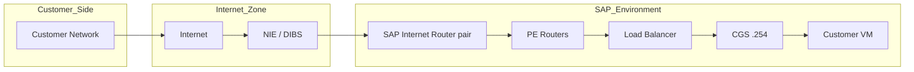

```mermaid
flowchart LR
   subgraph Customer_Side
       A[Customer Network]
   end
   subgraph Internet_Zone
       B[Internet]
       C[NIE / DIBS]
   end
   subgraph SAP_Environment
       D[SAP Internet Router pair]
       E[PE Routers]
       F[Load Balancer]
       G[CGS .254]
       H[Customer VM]
   end
   A --> B --> C --> D --> E --> F --> G --> H

```

