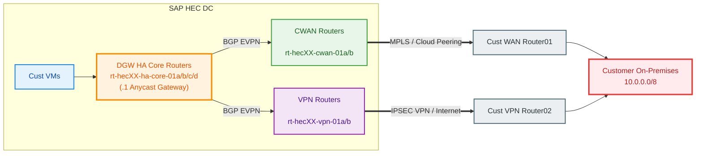
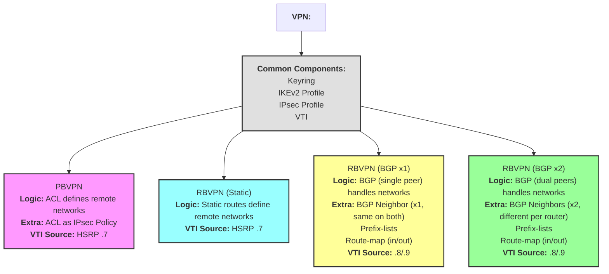
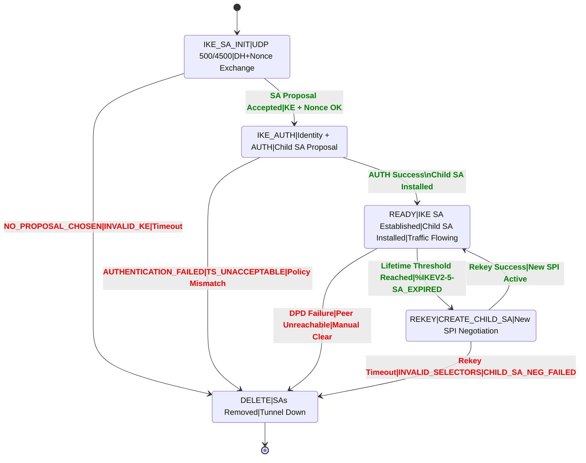

# VPN Basics
---

<!-- =========================
     IKEv2 / IPsec Reference
     ========================= -->

<details>
<summary>🟦 Notes</summary>

<pre><code>HDR   = Internet Key Exchange (IKE) Header = Who I am / Message envelope
SK    = Encrypted and Integrity-Protected Payload inside HDR
IDi   = Identification – Initiator
AUTH  = Authentication Payload = Proof I know PSK
SAi2  = Security Association – Initiator (CHILD SA / Phase-2) = Data encryption rules
TSi   = Traffic Selector – Initiator = Which subnets to encrypt
TSr   = Traffic Selector – Responder = Which subnets to encrypt

IDi + AUTH → Trust built
Identity + successful authentication = verified peer.
Once trust is validated, encrypted negotiation can continue.

Trust → Data tunnel allowed
Only after mutual authentication will IPsec SAs be created.
This prevents unauthorized or spoofed tunnel creation.

Internet        → carries IPsec
The public internet transports IKE/ESP packets.
Only outer headers are visible; inner data stays encrypted.

Tunnel          → carries routing
The IPsec tunnel acts like a secure virtual link between sites.
Dynamic routing protocols travel inside it.

BGP             → carries prefixes
BGP exchanges routes to remote networks through the IPsec tunnel.
This decides how traffic flows between the two sites.

ESP             → protects data
ESP = Encapsulating Security Payload, Protocol = 50
ESP encrypts, authenticates, and secures actual payload traffic.
Everything inside ESP is unreadable to intermediaries.

Policy-based VPN = ACL selects traffic
Traffic is matched against ACL rules to determine what enters the tunnel.
More static and suited for simple point-to-point connections.

Route-based VPN  = Routing selects traffic
A virtual tunnel interface is used, and routing decides traffic flow.
Supports BGP, multiple networks, and flexible topologies.

SPI = Security Parameter Index
A 32‑bit label used to identify the correct IPsec SA.
Every ESP packet includes an SPI for fast lookup.
Different SPIs exist for each direction.

BGP OVER IPsec 
BGP runs inside the tunnel, securing TCP 179.
Provides dynamic route exchange between sites.
Ideal for multi‑network or redundant designs.

Time-based rekey   = After lifetime expiry
Triggers after configured SA lifetime expiring (e.g., 3600s).
Ensures keys are refreshed periodically for better security.

Volume-based rekey = After data threshold
Triggered after a data threshold (MB/GB) is crossed.
Prevents excessive data exposure under a single key.

NAT present → ESP in UDP 4500
No NAT     → ESP directly

Tunnel Mode:    Encrypts entire original IP packet (header + payload) and adds a new IP header — used for site-to-site VPNs.
Transport Mode: Encrypts only the payload of the IP packet, keeping the original IP header — mainly used for host-to-host VPNs.

DH (Diffie-Hellman): A key-exchange method that lets two devices create the same secret key over an untrusted network without sending the key itself.
PFS (Perfect Forward Secrecy): Forces fresh DH key generation for every Phase-2 so old keys can’t decrypt new or past traffic even if one key is compromised.
AES (Advanced Encryption Standard): The symmetric cipher that encrypts VPN data payloads (e.g., AES-256 = stronger encryption).
SHA (Secure Hash Algorithm): Provides integrity and authentication by hashing packets so any tampering is detected.

IKEv2 Phase-1 = Trust + control channel, 4 messages, DH + AES + SHA + PSK
IKEv2 Phase-2 = Data encryption, 2 messages, PFS optional, ESP transform set
</code></pre>
</details>

<!-- ========================= -->

<details>
<summary>🟦 PHASE‑1</summary>

<pre><code>## 🔐 PHASE‑1 (IKE_SA – Internet Key Exchange Security Association)

Purpose:
Create a secure and trusted control channel between SAP and CUSTOMER_A VPN devices.

What happens:
- Devices exchange keys (DH)
- Authenticate each other using PSK → this is where TRUST is built
- Agree how future negotiations will be protected
</code></pre>

<b>Messages &amp; Trust</b>
<pre><code>IKE_SA_INIT  : Request + Response (2 messages)
IKE_AUTH     : Request + Response (2 messages)
---------------------------------------------
Total        : 4 messages
</code></pre>

<hr/>

<b>PHASE‑1 (IKE_SA) — REQUEST / RESPONSE</b>
<pre><code>SAP ASR 1002-HX (Initiator)          CUSTOMER_A (Responder)
198.98.99.9                          203.62.63.64
</code></pre>

<pre><code>================================================================
(1) IKE_SA_INIT — REQUEST  (UDP 500)
----------------------------------------------------------------
HDR, SAi, KEi, Ni  --------------------------------------------&gt;
        • SAi  = IKE proposal (AES256 / SHA256 / DH-14)
        • KEi  = SAP DH public key
        • Ni   = SAP nonce
</code></pre>

<pre><code>(2) IKE_SA_INIT — RESPONSE (UDP 500)
----------------------------------------------------------------
                                &lt;--------------------------------
                                HDR, SAr, KEr, Nr
                                • SAr = Accepted proposal
                                • KEr = CUSTOMER_A DH public key
                                • Nr  = CUSTOMER_A nonce
</code></pre>

<pre><code>🔐 RESULT AFTER IKE_SA_INIT:
• DH-14 key exchange completed
• Shared secret derived
• Still NO authentication
================================================================
</code></pre>

<pre><code>IKE_AUTH (Message 3 &amp; 4)
SAP ASR 1002-HX (Initiator)          CUSTOMER_A (Responder)
================================================================
</code></pre>

<pre><code>(3) IKE_AUTH — REQUEST  (UDP 500)
----------------------------------------------------------------
HDR, SK {
        IDi,
        AUTH,
        SAi2,
        TSi,
        TSr
} --------------------------------------------------------------&gt;
        • IDi  = SAP identity
        • AUTH = PSK authentication (cisco@9051#)
        • SAi2 = CHILD_SA proposal
        • TSi  = 192.168.10.0/24
        • TSr  = 172.168.20.0/24
</code></pre>

<pre><code>(4) IKE_AUTH — RESPONSE (UDP 500)
----------------------------------------------------------------
                                &lt;--------------------------------
                                HDR, SK {
                                        IDr,
                                        AUTH,
                                        SAr2,
                                        TSi,
                                        TSr
                                }
                                • IDr  = CUSTOMER_A identity
                                • AUTH = PSK verified
                                • SAr2 = CHILD_SA accepted
</code></pre>

<pre><code>================================================================
✅ IKE_SA ESTABLISHED (PHASE-1 COMPLETE)
================================================================
</code></pre>
</details>

<!-- ========================= -->

<details>
<summary>🟦 PHASE‑2</summary>

<pre><code>## 🔒 PHASE‑2 (CHILD_SA – IPsec Security Association)

Purpose:
Create a trusted and encrypted tunnel for actual data traffic.
</code></pre>

<b>Messages &amp; Trust</b>
<pre><code>CREATE_CHILD_SA : Request + Response (2 messages)
-----------------------------------------------
Total           : 2 messages
</code></pre>

<pre><code>SAP ASR 1002-HX (Initiator)          CUSTOMER_A (Responder)
================================================================
</code></pre>

<pre><code>(5) CREATE_CHILD_SA — REQUEST
----------------------------------------------------------------
HDR, SK {
        SA,
        Ni,
        KEi,
        TSi,
        TSr
} --------------------------------------------------------------&gt;
        • SA  = ESP proposal (AES256 / SHA256)
        • Ni  = New nonce
        • KEi = PFS DH-14 key
        • TSi = 192.168.10.0/24
        • TSr = 172.168.20.0/24
</code></pre>

<pre><code>(6) CREATE_CHILD_SA — RESPONSE
----------------------------------------------------------------
                                &lt;--------------------------------
                                HDR, SK {
                                        SA,
                                        Nr,
                                        KEr,
                                        TSi,
                                        TSr
                                }
                                • SA  = ESP accepted
                                • Nr  = Responder nonce
                                • KEr = Responder DH key
</code></pre>

<pre><code>================================================================
✅ IPsec CHILD_SA ESTABLISHED (PHASE-2 COMPLETE)
================================================================
</code></pre>
</details>

<!-- ========================= -->

<details>
<summary>🟦 BIG PICTURE (ASCII)</summary>

<pre><code>Phase-1 (IKE_SA)   → 4 messages → TRUST established
Phase-2 (CHILD_SA) → 2 messages → DATA tunnel created
-----------------------------------------------
TOTAL              → 6 messages
</code></pre>

<b>Wireshark View</b>
<pre><code>1  IKE_SA_INIT      Request
2  IKE_SA_INIT      Response
3  IKE_AUTH         Request
4  IKE_AUTH         Response
5  CREATE_CHILD_SA  Request
6  CREATE_CHILD_SA  Response
</code></pre>

<hr/>

<h4>📦 FULL ASCII (Packet &amp; Path Views)</h4>

<pre><code>--------------------------------------------------------
A) IKEv2 PHASE-1 PACKET (UDP 500) – FULL ON-WIRE FORMAT
--------------------------------------------------------

|-------------------- Ethernet --------------------|
| Src MAC: SAP-ASR-MAC                             |
| Dst MAC: ISP-GW-MAC                              |
| Ethertype: 0x0800 (IPv4)                         |
|--------------------------------------------------|
|----------------------- IP -----------------------|
| Version: 4                                       |
| Header Length: 20 bytes                          |
| DSCP: 0                                          |
| Total Length: 412                                |
| Identification: 0x1a2b                           |
| Flags: DF=1 MF=0                                 |
| Fragment Offset: 0                               |
| TTL: 64                                          |
| Protocol: UDP (17)                               |
| Src IP: 198.98.99.9                              |
| Dst IP: 203.62.63.64                             |
|--------------------------------------------------|
|----------------------- UDP ----------------------|
| Src Port: 500                                    |
| Dst Port: 500                                    |
| Length: 392                                      |
| Checksum: 0x9f2a                                 |
|--------------------------------------------------|
|----------------------- IKE ----------------------|
| Exchange: IKE_SA_INIT                            |
| SAi: AES256 / SHA256 / DH-14                     |
| KEi: DH Public Key                               |
| Ni: Initiator Nonce                              |
|--------------------------------------------------|
</code></pre>

<pre><code>--------------------------------------------------------
B) IKEv2 AUTH PACKET (ENCRYPTED PAYLOAD)
--------------------------------------------------------

|----------------------- IKE -----------------------|
| HDR                                              |
|--------------------------------------------------|
| 🔐 SK (Encrypted Payload)                        |
|   - IDi                                          |
|   - AUTH                                         |
|   - SAi2                                         |
|   - TSi                                          |
|   - TSr                                          |
|--------------------------------------------------|
</code></pre>

<pre><code>--------------------------------------------------------
C) ESP DATA PACKET (NO NAT)
--------------------------------------------------------

|-------------------- Ethernet --------------------|
| Src MAC: SAP-ASR-MAC                             |
| Dst MAC: ISP-GW-MAC                              |
|--------------------------------------------------|
|----------------------- IP -----------------------|
| Src IP: 198.98.99.9                              |
| Dst IP: 203.62.63.64                             |
| TTL: 63                                          |
| Protocol: ESP (50)                               |
|--------------------------------------------------|
|----------------------- ESP ----------------------|
| SPI: 0x12345678                                  |
| Sequence Number: 1024                            |
|--------------------------------------------------|
|************* ENCRYPTED **************************|
| Inner IP Src: 192.168.10.10                      |
| Inner IP Dst: 172.168.20.20                      |
| Inner TTL: 64                                    |
| Protocol: TCP                                    |
| Src Port: 52344                                  |
| Dst Port: 443                                    |
| Flags: PSH, ACK                                  |
| Data: Application Payload                        |
| Padding / Pad Length / Next Header               |
| ICV (HMAC-SHA256)                                |
|*************************************************|
</code></pre>

<pre><code>--------------------------------------------------------
D) ESP WITH NAT-T (UDP 4500)
--------------------------------------------------------

|----------------------- IP -----------------------|
| Src IP: 198.98.99.9                              |
| Dst IP: 203.62.63.64                             |
| Protocol: UDP (17)                               |
|--------------------------------------------------|
|----------------------- UDP ----------------------|
| Src Port: 4500                                   |
| Dst Port: 4500                                   |
|--------------------------------------------------|
|----------------------- ESP ----------------------|
| SPI / Seq / Encrypted Payload                    |
|--------------------------------------------------|
</code></pre>

<pre><code>--------------------------------------------------------
E) TTL HOP-BY-HOP VIEW (OUTER IP)
--------------------------------------------------------

SAP Host (TTL=64)
 → SAP ASR (63)
 → ISP (62)
 → Internet (61)
 → CUSTOMER_A Router (60)
</code></pre>

<pre><code>--------------------------------------------------------
F) MTU / MSS NUMERIC IMPACT
--------------------------------------------------------

Ethernet MTU: 1500
IP + ESP Overhead: ~56 bytes
Effective Inner MTU: ~1444
Recommended TCP MSS Clamp: 1360–1400
</code></pre>

<pre><code>--------------------------------------------------------
G) DIRECTIONAL SPI VIEW
--------------------------------------------------------

SAP → CUSTOMER_A:
Outbound SPI: 0x12345678

CUSTOMER_A → SAP:
Outbound SPI: 0x87654321

(Each direction uses a different SA)
</code></pre>

<pre><code>--------------------------------------------------------
H) CONTROL vs DATA PLANE QUICK MAP
--------------------------------------------------------

Control Plane:
UDP 500 / 4500
IKE_SA_INIT
IKE_AUTH

Data Plane:
ESP (Protocol 50)
Encrypted Inner IP + TCP/UDP/ICMP
</code></pre>
</details>

---

# VRF-Aware IPsec VPN with EVPN Stitching 
## Design, Configuration Breakdown & Verification (Cisco IOS XE)

## 1. Purpose of This Design

This design enables:

- Secure **policy & route-based IPsec VPN** termination
- **Per-customer routing isolation** using VRFs
- **EVPN L3 (Type-5) integration** with Arista HA core
- **Deterministic PE preference** using AS-path prepending
- **Hot-standby paths** across multiple PEs without HA-core changes

<br>

**Order of Preference for HA-Core:**

| Priority |  Device  |    Role   |
| :------: | :------: | :-------: |
|     1    | cwan-01a |  Primary  |
|     2    | cwan-01b | Secondary |
|     3    |  vpn-01a |  Third    |
|     4    |  vpn-01b |   Fourth  |

<br>

**Typical Customer On-premises Connectivity**



Changing customer preference is done by **moving the RT between PRIO lists**, not by modifying HA-core config.

---

## 2. VRF Definition – Customer Routing Isolation

### Configuration
```java
vrf definition CUSTOMER_0120
 description HEC17-CUSTOMER_0120-XIP
 rd 17:3120
 address-family ipv4
  route-target export 17:3120 stitching
  route-target import 17:2120 stitching
```

Why this is required:
- Creates a dedicated routing table per customer
- Allows overlapping IP space
- Enables EVPN stitching into the HA core

What breaks if missing
- Customer routes never reach EVPN
- Traffic is confined to a single PE

### Verification
```java
show vrf detail CUSTOMER_0120
show running-config vrf CUSTOMER_0120
show bgp l2vpn evpn route-target 17:3120
```

## 3. Bridge-Domain, BDI & L3 VNI (EVPN ↔ VRF Glue)

### BDI – L3 Gateway for EVPN
```java
interface BDI3120
 vrf forwarding CUSTOMER_0120
 ip address 198.19.248.254 255.255.255.254
```

### Bridge-Domain & VNI
```java
bridge-domain 3120
 member vni 3171200
!
interface nve1
 member vni 3171200 vrf CUSTOMER_0120
```

Why this is required
- BDI is the **L3 termination point** for EVPN routes
- Bridge-domain maps **EVPN VNI ↔ VRF**
- Enables **EVPN Type-5 route exchange**

What breaks if missing
- EVPN routes appear in control plane but **NOT** in routing table
- No forwarding between EVPN fabric and VPN

### Verification
```java
show interface BDI3120
show bridge-domain 3120
show nve vni
show ip route vrf CUSTOMER_0120
```

## 4. EVPN Priority Classification (HA Preference Control)

### Primary VPN Router (vpn-01a)
```java
ip extcommunity-list standard CL-EVPN-PRIO3
 permit rt 17:3120
```

### Secondary VPN Router (vpn-01b)
```java
ip extcommunity-list standard CL-EVPN-PRIO4
 permit rt 17:3120
```

Why this is required
- Groups customer EVPN routes into **priority tiers**
- Each tier applies a **different AS-path prepend**
- HA core always selects the **shortest AS-path**

What breaks if missing
- Wrong PE becomes active
- Traffic flows via unexpected path

### Verification
```java
show running-config | section extcommunity-list
show bgp l2vpn evpn route-target 17:3120 detail
show bgp l2vpn evpn neighbors <ha-core-peer> advertised-routes
```

## 5. VPN Configuration

### Crypto Keyring
```
crypto ikev2 keyring KR_GTY
   peer 196.41.253.229
      address 196.41.253.229
      pre-shared-key local cBqEfYyzdZNEDfytTA6u8g3vnDQvfb
      pre-shared-key remote cBqEfYyzdZNEDfytTA6u8g3vnDQvfb
!
```

Why this is required
- Defines the **pre-shared-key** which should be **identical** on both customer and SAP side.

What breaks if missing
- Phase1 status remains in ```MM_NO_STATE```

### Verification
```java
show running-config | section extcommunity-list
show bgp l2vpn evpn route-target 17:3120 detail
show bgp l2vpn evpn neighbors <ha-core-peer> advertised-routes
```

## 6. Customer-Specific VPN Components

### Crypto Keyring

```java
crypto ikev2 keyring KR_TST
 peer P_203.13.156.7
   address 203.13.156.7
   pre-shared-key local find-me-if-you-can
   pre-shared-key remote find-me-if-you-can
 !
```

#### Why this is required

- Defines the remote peer and pre-shared keys for IKEv2 authentication.
- Ensures both ends of the VPN tunnel use the same credentials for secure establishment.

#### What breaks if missing

- IKEv2 negotiation will fail; tunnel cannot be established.
- Authentication errors will prevent Phase 1 from completing.
- IKE state: `MM_NO_STATE` or `NO_PROPOSAL_CHOSEN`.

---

### IKEv2 Profile

```java
crypto ikev2 profile IKEProf_CUSTOMER_0099
 match fvrf INTERNET
 match identity remote address 203.13.156.7 255.255.255.255
 authentication remote pre-share
 authentication local pre-share
 keyring local KR_TST
!
```

#### Why this is required

- Binds the keyring to the VPN profile for this customer.
- Specifies which remote peer and VRF to match for tunnel setup.
- Ensures correct authentication and key exchange parameters.

#### What breaks if missing

- Tunnel will not match incoming connections from the customer.
- Authentication or keyring association may fail, blocking tunnel setup.
- IKE state: `NO_MATCH` or `AUTHENTICATION_FAILED`.

---

### IPsec Profile

```php
crypto ipsec profile IPSEC_CUSTOMER_0099_3099005
 set transform-set AES256_SHA256_Tunnel 
 set pfs group15
 set ikev2-profile IKEProf_CUSTOMER_0099
 reverse-route
!
```

#### Why this is required

- Defines encryption and integrity algorithms for the tunnel.
- Associates the IKEv2 profile for negotiation.
- Enables Perfect Forward Secrecy (PFS) for enhanced security.
- `reverse-route` injects remote protected subnets into routing.

#### What breaks if missing

- Tunnel may use weak or incompatible encryption.
- No dynamic route injection; traffic may not be routed correctly.
- Tunnel establishment may fail if profile is not referenced.
- IKE state: `NO_PROPOSAL_CHOSEN` or `NO_POLICY_FOUND`.

---

### Access Control List (ACL)

```java
ip access-list extended ACL_CUSTOMER_0099_3099005
 10 permit ip 10.10.90.0 0.0.0.255 10.10.7.0 0.0.0.255
```

#### Why this is required

- Specifies which traffic is protected by the IPsec tunnel.
- Ensures only authorized subnets are allowed through the VPN.

#### What breaks if missing

- No traffic will match the crypto map; tunnel passes no data.
- Incorrect ACLs can cause over-permissive or blocked connectivity.
- IKE state: Tunnel may establish, but data traffic will not flow (no matching proxy ACL).

### Virtual Tunnel Interface (VTI) – VPN Tunnel

```shell
interface Tunnel3099005
 description HEC90-CUSTOMER_0099-TST-Tunnel5
 vrf forwarding CUSTOMER_0099
 ip unnumbered Port-channel10.940
 ip tcp adjust-mss 1350
 tunnel source 169.145.141.7
 tunnel mode ipsec ipv4
 tunnel destination 203.13.156.7
 tunnel vrf INTERNET
 tunnel protection ipsec policy ipv4 ACL_CUSTOMER_0099_3099005
 tunnel protection ipsec profile IPSEC_CUSTOMER_0099_3099005
```

#### Why this is required

- Provides a **route-based VPN** using a Virtual Tunnel Interface (VTI).
- Associates the tunnel with the correct customer VRF for routing isolation.
- Applies the IPsec profile where IKEv2 profile, Keyring are associated
- Applies ACL for encryption and traffic selection, only incase of **policy-based** VPN. (PBVPN)
- Enables dynamic routing and flexible traffic engineering over the VPN.

#### What breaks if missing

- No logical interface for encrypted traffic; VPN cannot pass data.
- Routing isolation is lost if VRF is not set.
- Tunnel will not establish or protect traffic without correct IPsec profile/ACL.

---

### Verification

```php
show interface Tunnel3099005
show crypto ikev2 sa
show crypto ipsec sa
show ip route vrf CUSTOMER_0099
```
---

## Supported VPN Types & Routing Options ([Customer VPN Guide](https://help.sap.com/doc/4d7f682ef9a74074aad5d3add48d3cb2/ALL/en-US/SAP_HEC_VPN_Guide.pdf))

In SAP HEC DC, we support both policy and route-based VPN setups. The standard and supported possible VPN use-cases are:
  - Policy-Based VPN
  - Route-Based VPN - BGP   with 2 VPN Peers
  - Route-Based VPN - BGP   with 1 VPN Peer
  - Route-Based VPN - Static with 1 VPN Peer


### 1. PBVPN with ACL

**Design:** 

- **Local & Customer Remote Networks** are defined by an ***ACL*** and applied to the VTI tunnel interface; must be **identical** on both sides.
- Remote networks in the ACL are injected into the customer VRF as static routes using the `reverse-route` (RRI) feature in the IPsec profile.
- This is possible only when network is configured indentically on both sides and Child SAs are created (Ex. `Active SAs: 2, origin: crypto map`)
- Adding or removing remote networks requires detaching the ACL from the VTI, modifying the ACL, and reattaching it—**downtime of 5–10 minutes** is required.

```java
ip access-list extended ACL_CUSTOMER_0099_3099005
 10 permit ip 10.10.90.0 0.0.0.255 10.10.7.0 0.0.0.255
 20 permit ip 10.10.90.0 0.0.0.255 10.10.8.0 0.0.0.255
 30 permit ip 10.10.90.0 0.0.0.255 10.10.9.0 0.0.0.255
```

---

### 2. RBVPN with Static Routing


**Design:** 

- **Customer Remote networks** are defined as static routes via the Tunnel interface (unlike policy-based VPN).
- Adding or removing remote networks does **not require downtime**.

```java
ip route vrf CUSTOMER_0010 10.10.7.0 255.255.255.0 Tunnel3099001
ip route vrf CUSTOMER_0010 10.10.8.0 255.255.255.0 Tunnel3099001
ip route vrf CUSTOMER_0010 10.10.9.0 255.255.255.0 Tunnel3099001
```

---

### 3. RBVPN with BGP Routing (1 or 2 Endpoints)

**Design:** 

- **2x eBGP neighbors** are configured (one from each VPN router).
- **Route filtering logic:**
   - Advertise only core network(s) to the customer.
   - Accept all networks from the customer except core network(s).
   - Achieved using prefix-lists and route-maps for inbound & outbound directions.
   - BGP neighbors can be directly connected or routed via VTI (e.g., ebgp-multihop); additional static route may be required.
- Addition of remote networks is handled by BGP as long as the customer advertises them—**no SAP-side change required**.


```java
ip prefix-list CUST0099_TST_FILTER_TUN1_IN seq 5 deny 10.10.1.0/24
!
ip prefix-list CUST0099_TST_FILTER_TUN1_IN seq 10 permit 0.0.0.0/0 le 32
ip prefix-list CUST0099_TST_FILTER_TUN1_OUT seq 5 permit 10.10.1.0/24
!
route-map CUST0099_TST_FILTER_TUN1_OUT permit 10 
 match ip address prefix-list CUST0099_TST_FILTER_TUN1_OUT
route-map CUST0099_TST_FILTER_TUN1_OUT deny 1000 
!
route-map CUST0099_TST_FILTER_TUN1_IN permit 10 
 match ip address prefix-list CUST0099_TST_FILTER_TUN1_IN
route-map CUST0099_TST_FILTER_TUN1_IN deny 1000 
!
router bgp 65524.90
 address-family ipv4 vrf CUSTOMER_0099
   advertise l2vpn evpn 5000
   import path selection all
   redistribute connected
   redistribute static
   neighbor 169.254.1.2 remote-as 65002
   neighbor 169.254.1.2 timers 10 30 30
   neighbor 169.254.1.2 password 7 xxxxxxxxxxx
   neighbor 169.254.1.2 activate
   neighbor 169.254.1.2 soft-reconfiguration inbound
   neighbor 169.254.1.2 route-map CUST0099_TST_FILTER_TUN1_IN in
   neighbor 169.254.1.2 route-map CUST0099_TST_FILTER_TUN1_OUT out
   neighbor 169.254.1.2 maximum-prefix 5000 80 restart 1
   maximum-paths 4
   default-information originate
   default-metric 50
 exit-address-family
```

## 7. Support VPN Tunnel Types ([Customer VPN Guide](https://help.sap.com/doc/4d7f682ef9a74074aad5d3add48d3cb2/ALL/en-US/SAP_HEC_VPN_Guide.pdf))

| Tunnel Type | Routing Logic | Key Components | VTI Source IP | BGP Peering | Route Filtering |
| :--- | :--- | :--- | :--- | :--- | :--- |
| **PBVPN** | Remote networks defined by `ACL` | Keyring, IKEv2/IPsec profiles, VTI, ACL as IPsec policy | HSRP virtual IP (`.7`) | None | N/A |
| **RBVPN (Static)** | Remote networks defined by `static routes` | Keyring, IKEv2/IPsec profiles, VTI | HSRP virtual IP (`.7`) | None | N/A |
| **RBVPN (BGP x1)** | Networks learned via `BGP` | Keyring, IKEv2/IPsec profiles, VTI, BGP neighbor config | Physical IP (`.8`/`.9`) | 1 peer (same on both routers), reachable via VTI | Prefix-lists & route-maps |
| **RBVPN (BGP x2)** | Networks learned via `BGP` | Keyring, IKEv2/IPsec profiles, VTI, BGP neighbor config | Physical IP (`.8`/`.9`) | 2 peers (different per router), reachable via VTI | Prefix-lists & route-maps |

**VPN Type Comparison - Diagram**


---

## 8. VPN Troubleshooting

**IKEv2 Negotiation Messages**

```mermaid
sequenceDiagram
    autonumber
    participant C as Client (Initiator)
    participant R as VPN Gateway (Responder)

    Note over C,R: IKEv2 Phase 1 – IKE_SA_INIT

    C->>R: IKE_SA_INIT<br/>SAi1, KEi, Ni
    R-->>C: IKE_SA_INIT<br/>SAr1, KEr, Nr

    Note over C,R: Keys derived, IKE SA established [web:6][web:4]

    Note over C,R: IKEv2 Phase 1 – IKE_AUTH (first CHILD SA)

    C->>R: IKE_AUTH (encrypted)<br/>IDi, Auth, SAi2, TSi, TSr, CERT/EAP(opt)
    R-->>C: IKE_AUTH (encrypted)<br/>IDr, Auth, SAr2, TSi, TSr, CERT(opt)

    Note over C,R: IKE SA up, first CHILD SA (IPsec SA) created [web:6][web:10]

```



---

**IKEv2/IPsec state-machine diagram**



**VPN Decodes**

 - 1a. If the Initiator state is  "waiting for INIT response", then the remote end has still not acknowledged the IKE_SA_INIT Request and is most likely an IP reachability issue, UDP 500/4500 not open between endpoints, or NAT configured at remote end is not a STATIC 1-1 NAT (essential for VPN). 
 - 1b. If the state is "waiting for AUTH Response" then the remote peer is not able to authenticate itself (most likely due to asymmetric routing) or cached sessions. Try clearing the VPN sessions at both ends. If there is an authentication failed response from remote, then most likely it is due to PSK mismatch. 
 - 1c. If you notice policy not found error message in the debug logs, then verify if the phase-1 parameters are hardcoded at customer end. Please note that at SAP end the phase-1 parameters are sent as a proposal set and hence it is mandatory that the remote end has the most specific phase-1 parameters rather than multiple parameters. This is essential to have a smooth rekeying that occurs once the phase-1 lifetime expires.  
 - 1d. If you notice "Peer not found" message in debugs, then check if the remote end has a NAT and the inside IP (untranslated IP) is configured under IKE pofile for the customer.  
 - 1e. If you don't notice any "IKE_SA_INIT Request" from customer end then most likely there is a routing issue at remote end or there is a port translation where UDP 500/4500 may be translated to a dynamic port. At SAP end, we expect the IKE request to come from either UDP 500 or 4500; IKE requests on any other port will be dropped by the SAP INET routers (ACL 100). 
 - 1f. If the Phase-2 remains in UP-IDLE state, then the Child SAs has not negotiated well and could be possibly because of Traffic selector mismatch. 
 - 1g If the remote responds with a TS_MISMATCH (traffic selector mismatch) then verify if the ACLs are matching (policy based) at both ends. For route based VPN, check if remote end has incorrectly configured any traffic selectors. 
 - 1h.If the remote responds with a policy mismatch, then verify if the phase-2 parameters matches at both ends.

**Supported & Strong Cipher Suites**

- **Phase-1:**
   - IKEv2-AES256-SHA384-DHgroup20-86400s : Main Mode ( (recommended) 
   - IKEv2-AES256-SHA512-DHgroup24-86400s 
   - IKEv2-AES256-SHA256-DHgroup15-86400s : Main Mode (Variant) 
   - IKEv2-AES256-SHA256-DHgroup5-86400s : : Main Mode (Variant)
     
 - **Phase-2:**
   - AES-GCM256-PFSgroup20-3600s 
   - AES-GCM256-PFSgroup15-3600s 
   - AES256-SHA256-PFSgroup15-3600s : Quick Mode 
   - AES256-SHA256-PFSgroup5-3600s : Quick Mode 
   - AES256-SHA256-PFSgroup20-3600s : Quick Mode 
   - AES256-SHA384-PFSgroup20-3600s 
   - AES256-SHA384-PFSgroup15-3600s 
   - AES256-SHA1-PFSgroup15-3600s 
   - AES256-SHA1-PFSgroup5-3600s 


---
