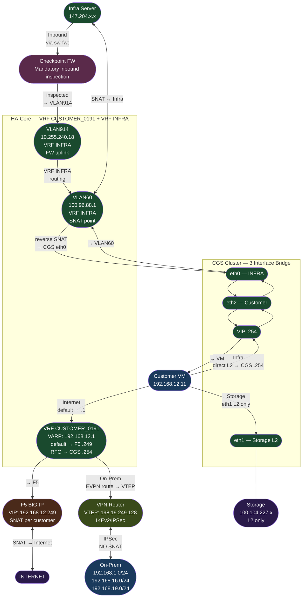

```mermaid
flowchart TD

  %% Top-level nodes
  INTERNET([INTERNET])
  ONPREM([On-Prem<br/>192.168.1.0/24<br/>192.168.16.0/24<br/>192.168.19.0/24])
  INFRASRV([Infra Server<br/>147.204.x.x])
  F5([F5 BIG-IP<br/>VIP: 192.168.12.249<br/>SNAT per customer])
  VPN([VPN Router<br/>VTEP: 198.19.249.128<br/>IKEv2/IPSec])
  FW([Checkpoint FW<br/>Mandatory inbound inspection])
  VM([Customer VM<br/>192.168.12.11])

  %% Subgraph: HA-Core
  subgraph HACORE ["HA-Core — VRF CUSTOMER_0191 + VRF INFRA"]
    HACUST([VRF CUSTOMER_0191<br/>VARP: 192.168.12.1<br/>default → F5 .249<br/>RFC → CGS .254])
    V60([VLAN60<br/>100.96.88.1<br/>VRF INFRA<br/>SNAT point])
    V914([VLAN914<br/>10.255.240.18<br/>VRF INFRA<br/>FW uplink])
  end

  %% Subgraph: CGS Cluster
  subgraph CGS ["CGS Cluster — 3 Interface Bridge"]
    CGSV([VIP .254])
    ETH2([eth2 — Customer])
    ETH0([eth0 — INFRA])
    ETH1([eth1 — Storage L2])
  end

  STR([Storage<br/>100.104.227.x<br/>L2 only])

  %% Internet flow
  VM -->|"Internet<br/>default → .1"| HACUST
  HACUST -->|"→ F5"| F5
  F5 <-->|"SNAT ↔ Internet"| INTERNET

  %% Infra outbound
  VM -->|"Infra<br/>direct L2 → CGS .254"| CGSV
  CGSV --> ETH2 --> ETH0
  ETH0 -->|"→ VLAN60"| V60
  V60 <-->|"SNAT ↔ Infra"| INFRASRV

  %% On-Prem
  HACUST -->|"On-Prem<br/>EVPN route → VTEP"| VPN
  VPN <-->|"IPSec<br/>NO SNAT"| ONPREM

  %% Inbound from Infra
  INFRASRV -->|"Inbound<br/>via sw-fwt"| FW
  FW -->|"inspected<br/>→ VLAN914"| V914
  V914 -->|"VRF INFRA<br/>routing"| V60
  V60 -->|"reverse SNAT<br/>→ CGS eth0"| ETH0
  ETH0 --> ETH2 --> CGSV
  CGSV -->|"→ VM"| VM

  %% Storage
  VM -->|"Storage<br/>eth1 L2 only"| ETH1
  ETH1 --- STR

  %% Styling (subgraph boxes themselves cannot be styled directly)
  style INTERNET fill:#2a1a4a,color:#fff
  style ONPREM fill:#1a3a5c,color:#fff
  style INFRASRV fill:#1a4a2e,color:#fff
  style F5 fill:#4a2a1a,color:#fff
  style VPN fill:#394a1a,color:#fff
  style FW fill:#5a2a4a,color:#fff
  style VM fill:#1a3a5c,color:#fff
  style CGSV fill:#1a4a2e,color:#fff
  style ETH2 fill:#1a4a2e,color:#fff
  style ETH0 fill:#1a4a2e,color:#fff
  style ETH1 fill:#1a4a2e,color:#fff
  style HACUST fill:#1a4a2e,color:#fff
  style V60 fill:#1a4a2e,color:#fff
  style V914 fill:#1a4a2e,color:#fff
  style STR fill:#2a1a4a,color:#fff
```
