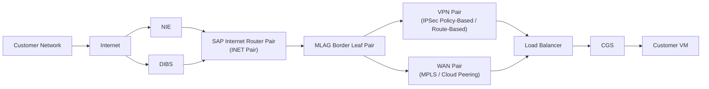

```mermaid
flowchart LR

%% ===========================
%%     NODES
%% ===========================

A[Customer Network]
B[Internet]

C[NIE]
C2[DIBS]

INET["SAP Internet Router Pair<br/>(INET Pair)"]

BL[MLAG Border Leaf Pair]

VPN["VPN Pair<br/>(IPSec Policy‑Based / Route‑Based)"]
WAN["WAN Pair<br/>(MPLS / Cloud Peering)"]

F[Load Balancer]
G[CGS]
H[Customer VM]
%%     FLOWS
%% ===========================

A --> B
B --> C & C2

C --> INET
C2 --> INET

INET --> BL

%% Fan‑out from Border Leaf
BL --> VPN
BL --> WAN

%% Convergence
VPN --> F
WAN --> F

F --> G --> H
```
