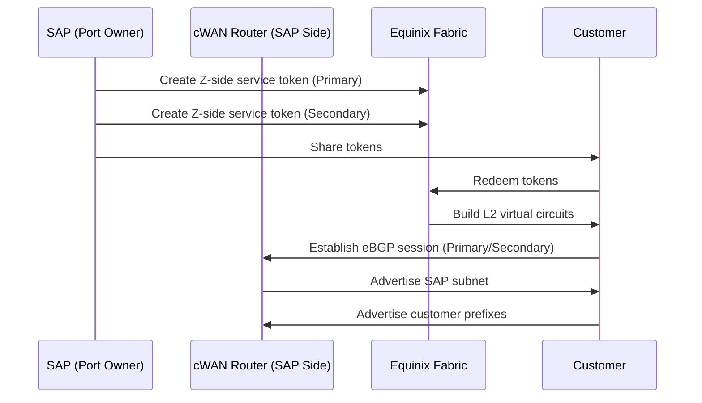

```mermaid
sequenceDiagram
    participant SAP as SAP (Port Owner)
    participant CWAN as cWAN Router (SAP Side)
    participant EQ as Equinix Fabric
    participant CUST as Customer

    SAP->>EQ: Create Z-side service token (Primary)
    SAP->>EQ: Create Z-side service token (Secondary)
    SAP->>CUST: Share tokens

    CUST->>EQ: Redeem tokens
    EQ->>CUST: Build L2 virtual circuits

    CUST->>CWAN: Establish eBGP session (Primary/Secondary)
    CWAN->>CUST: Advertise SAP subnet
    CUST->>CWAN: Advertise customer prefixes

```
