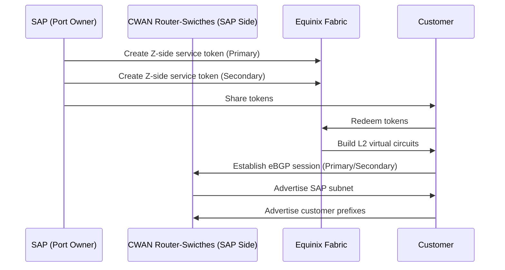

## Summary
This document provides the complete reference architecture and a concrete runbook for SAP(IaaS) Cloud Peering service connectivity

# Cloud Peering
The cloud pairing is a simple plug & play service which is equivalent to the the direct connect from AWS or maybe express route from Azure or maybe the Google Cloud interconnect from GCP. Example: interconnection ecosystem providers like Equinix and MegaPort.

SAP has cloud peering connection which doesn’t require any physical link of the cable or devices. If customer has any internet connectivity from any Internet Service Provider i.e Equinix, Megaport, Verizon, etc… SAP would be able to connect virtually and provide cloud peering connection.

The difference between MPLS and cloud peering is that both provide private or dedicated connectivity solutions for customers. However, the key difference is that with MPLS, the customer can bring their own device and connect the circuit end‑to‑end directly with the service provider, while cloud peering does not involve customer‑managed end‑to‑end circuits in the same way.

👉Goal:
On-prem network  ⇄  SAP HEC application subnet

# Architecture Model

There is a 3‑Domain Model:

### (1) Data Center Fabric (EVPN/VXLAN)
- Hosts workloads (HEC/S4/HANA)  
- Uses Anycast Gateway (10.x.x.1)  
- EVPN Type‑5 advertises SAP subnet prefixes  
- Fast east‑west movement inside DC  

### (2) WAN/VPN Edge (CWAN)
- Terminates customer Cloud Peering  
- VRF CUSTOMER_0XXX  
- Converts EVPN Type‑5 → VPNv4  
- Attaches PRIO communities  
- Adds Local‑Pref or AS‑Path prepend  

### (3) SAP ONE Backbone (MPLS Transport)
- Pure transport layer (PE → P → PE)  
- No routing policy  
- No VRF decisions in P nodes  
- Moves VRF traffic using labels 

```mermaid
%% Mermaid table-like grid
flowchart TB
    classDef header fill:#e0e0e0,stroke:#000,font-weight:bold;

    SL1["1"]:::header --> D1["DC (EVPN)"] --> R1["Compute + Tenant Isolation + Anycast GW"]
    SL2["2"]:::header --> D2["cwan-01b"] --> R2["All Routing Logic + VRF Policies"]
    SL3["3"]:::header --> D3["MPLS Core (SOB)"] --> R3["High‑speed Label Transport Only"]

```



# Architecture Overview

```mermaid

flowchart LR

%% ===========================
%% Global Styling for Big Diagram
%% ===========================
classDef big stroke-width:4px, font-size:22px, padding:25px;

classDef customer fill:#4DA3FF,stroke:#005B99,color:#fff,stroke-width:4px,font-size:22px,padding:25px;
classDef telco fill:#A6A6A6,stroke:#4D4D4D,color:#fff,stroke-width:4px,font-size:22px,padding:25px;
classDef interco fill:#B3E6FF,stroke:#0099CC,color:#000,stroke-width:4px,font-size:22px,padding:25px;
classDef qinq fill:#FFD480,stroke:#CC8E00,color:#000,stroke-width:4px,font-size:22px,padding:25px;
classDef sap fill:#F28585,stroke:#993333,color:#000,stroke-width:4px,font-size:22px,padding:25px;
classDef cwan fill:#D5B3FF,stroke:#6A4D99,color:#000,stroke-width:4px,font-size:22px,padding:25px;
classDef core fill:#8FD9A8,stroke:#3F8F5E,color:#000,stroke-width:4px,font-size:22px,padding:25px;

linkStyle default stroke-width:4px;

%% ================================================================
%% VLAN 100 → 401   AND   VLAN 200 → 501  (Horizontal view)
%% ================================================================

%% LEFT: CUSTOMER
H1[CUSTOMER HOST
C‑VLAN 100]:::customer
H2[CUSTOMER HOST
C‑VLAN 200]:::customer

H1 --> CE1[CE1
Customer Edge]:::customer
H2 --> CE2[CE2
Customer Edge]:::customer

%% TELCO
CE1 --> DT1[Deutsche Telekom_PE1
L2/L3 Handoff]:::telco
CE2 --> DT2[Deutsche Telekom_PE2
L2/L3 Handoff]:::telco

%% INTERCONNECT Dual-Homed
DT1 --> EQ1[Equinix_PE1
Fabric Port‑1]:::interco
DT2 --> EQ2[Equinix_PE2
Fabric Port‑2]:::interco

%% CROSS-CONNECT — Dual active paths


%% QINQ Mapping
EQ1 --> Q1["Bundled QinQ Service
C‑VLANs 100/200
→
S‑TAGs 401/501"]:::qinq
EQ2 --> Q1

%% SAP ONE BACKBONE
Q1 --> SOB["SAP ONE BACKBONE
Ingress/Egress PEs
PE1a/P1a/PE1b
PE2a/P1b/PE2b

**MPLS VPN Label → CUSTOMER_0XXX**"]:::sap

%% CWAN SWITCHES
SOB --> SW1["CWAN_SW‑1"]:::cwan
SOB --> SW2["CWAN_SW‑2"]:::cwan

%% CWAN ROUTERS
SW1 --> RT1["CWAN_RT‑1
VRF CUSTOMER_0XXX
EVPN→VPNv4"]:::cwan
SW2 --> RT2["CWAN_RT‑2
VRF CUSTOMER_0XXX
EVPN→VPNv4"]:::cwan

%% BORDER ROUTERS
RT1 --> BR1[BRDR‑01a]:::sap
RT2 --> BR2[BRDR‑01b]:::sap

%% SAP FABRIC Common
BR1 --> SP[SAP SPINES]:::core
BR2 --> SP

SP --> CR[DC CORE]:::core
CR --> FAB[FABRIC VXLAN‑EVPN
Type‑5 Routes]:::core

FAB --> VIP["LB‑VIP"]:::sap
VIP --> APP["APP‑VM"]:::core

```

Before any config, SAP must know:
# 1. Required WAN Questionnaire in Service Request

Before any configuration, SAP must know:

- **Customer ID (CID):** XYZ  
- **Customer Name:** XYZ COMPANY  
- **Target HEC DC:** HEC07  
- **Customer ASN:** 65010  
- **Bandwidth:** 200 Mbps  

## Primary Peering Subnet (/30 or /31)
- **Network:** 10.21.52.12/30  
- **SAP IP:** 10.21.52.13  
- **Customer IP:** 10.21.52.14

## Secondary Peering Subnet (/30 or /31)
- **Network:** 10.21.52.16/30  
- **SAP IP:** 10.21.52.17  
- **Customer IP:** 10.21.52.18

**Optional:** BGP MD5 password

##  2. VLAN Reservation Logic

Each DC has fixed VLAN blocks.
Example:
Primary VLAN pool:   400–499
Secondary VLAN pool: 500–599

**👉Engineer checks free VLANs:**

Example allocation:
Primary VLAN:   401
Secondary VLAN: 501

Meaning:
401 → Primary BGP link
501 → Secondary BGP link
________________________________________

###  3. In High Availability Cloud Peering always lands on two CWAN routers (Primary & Secondary) & CWAN switches (Primary & Secondary), which may be Cisco ASR or Arista WAN devices depending on the DC build. The CWAN vendor is independent of whether the DC core is Cisco legacy (HEC 1.0) or Arista HA‑CORE (HEC 2.0)

## Why stitching is required (or not):
“HEC 2.0 (Arista HA‑CORE) requires route‑target stitching on Cisco CWAN because HA‑CORE advertises EVPN Type‑5 while the WAN uses VPNv4; HEC 1.0 (Cisco DC) speaks VPNv4 end‑to‑end so stitching is not needed.” 

## When to add the ip extcommunity PRIO tags (Cisco CWAN + Arista HA‑CORE):
“When the DC side is Arista HA‑CORE and CWAN is Cisco, tag exported service routes on the Cisco CWAN with PRIO communities using ip extcommunity‑list (e.g., CL‑EVPN‑PRIO1..4) and match them in the EVPN AF outbound route‑map—so HA‑CORE (which may not map Local‑Pref) still prefers PRIO1 via shortest AS‑Path.”

## L2 topology between CWAN switches and CWAN routers
Each router connects with port‑channels (LACP) to the switch pair, and the switch pair presents a trunk carrying Ex: VLAN 401 and 501 (among other allowed VLAN ranges per site policy). This provides link, device, and path diversity. Result: even if one switch or one link goes down, the VLAN(s) remain up via the other switch/link. This is why the routers are cabled to both switches.

## Examples for RT to ext-community mapping

The following table shows an example of which extended community list route‑target
should be added for a specific customer. In this example:

- **Customer_0011** (RT **10:3011**) has primary way via **CWAN** and backup via **VPN**  
- **Customer_0012** (RT **10:3012**) has primary way via **VPN** and no CWAN connection yet  
- **Customer_0013** (RT **10:3013**) has primary way via **VPN** and secondary via **CWAN**  
  (useful during maintenance)


| **CWAN Router / Extended Community List** | **CL‑EVPN‑PRIO1**              | **CL‑EVPN‑PRIO2**              | **CL‑EVPN‑PRIO3**               | **CL‑EVPN‑PRIO4**               |
|-------------------------------------------|--------------------------------|--------------------------------|----------------------------------|----------------------------------|
| **CWAN 01a router**                       | <span style="color:#c47f00;">10:3011</span> |                                | <span style="color:#3a8f3a;">10:3013</span>  |                                  |
| **CWAN 01b router**                       |                                | <span style="color:#c47f00;">10:3011</span> |                                  | <span style="color:#3a8f3a;">10:3013</span>  |
| **VPN 01a router**                        | <span style="color:#3a8f3a;">10:3013</span> |                                | <span style="color:#c47f00;">10:3011</span><br/><span style="color:#bb3377;">10:3012</span> |                                  |
| **VPN 01b router**                        |                                | <span style="color:#3a8f3a;">10:3013</span> |                                  | <span style="color:#c47f00;">10:3011</span><br/><span style="color:#bb3377;">10:3012</span> |

- Let's build the Cloud Peering configuration for **Cisco ASR**

## 4. VRF Naming and Numbering Standard
SAP standard: VRF = CUSTOMER_0XXX
Example:Customer Numeber = 201, VRF = CUSTOMER_0201, Vlan=2201
________________________________________
### VRF Configuration for Both CWAN router
```java
vrf definition CUSTOMER_0141
 description HEC01-CUSTOMER-QUP-0141
 rd 1:3141
 address-family ipv4
  route-target export 1:3141
  route-target import 1:2141
  route-target export 1:3141 stitching
  route-target import 1:2141 stitching
exit
```
👉 This ensures:
- Each customer isolated
- Those four RT lines are needed to keep the tenant’s normal RT policy (import/export) and to enable EVPN⇄VPNv4 “stitching” on the CWAN edge, which is mandatory whenever the DC side is Arista HA‑CORE (EVPN Type‑5) and the WAN side is VPNv4.

### 5. BDI,NVE Configuration for Both CWAN router
```java
bridge-domain 3141
member vni 3011410
!
interface nve1
member vni 3011410 vrf CUSTOMER_0141
exit
!
interface BDI3141
vrf forwarding CUSTOMER_0141
ip address 198.19.248.254 255.255.255.254
no mop enabled
no mop sysid
no shutdown
exit
```
👉 This ensures:
- 1) bridge-domain 3141 + member vni 3011410
 his binds the customer’s VRF to its L3 VNI (3011410) so EVPN Type‑5 routes for CUSTOMER_0141 can exist inside the DC fabric.

- 2) interface nve1 → member vni 3011410 vrf CUSTOMER_0141
 This advertises the L3 VNI (3011410) in EVPN for VRF CUSTOMER_0141 so HA‑CORE learns the VRF’s IP prefixes.👉 This is what makes the VRF visible inside the Arista HA‑CORE EVPN control‑plane.

- 3) interface BDI3141
 This provides the per‑VRF L3 SVI/anchor used internally for EVPN–VPNv4 stitching; the /31 IP is reused because each customer has its own VRF routing table.


### 6a. ip extcommunity-list for Primary cisco CWAN router
```java
ip extcommunity-list standard CL-EVPN-PRIO1
 141 permit rt 1:3141
 ```
👉 This ensures:
- Primary CWAN PRIO1= **Local‑Pref HIGH** & **AS‑Path = shortest**
-➡️ Always chosen first
### 6b. ip extcommunity-list for Secondary cisco CWAN router
```java
ip extcommunity-list standard CL-EVPN-PRIO2
 141 permit rt 1:3141
 ```
👉 This ensures:
- Primary CWAN PRIO2= **Local‑Pref LOW** & **AS‑Path = longer (due to prepend)**
-➡️ Always chosen first

- 👉👉 Let's Understand in deep:
### EVPN Edge Policy — PRIO Tagging + Tiered AS-Path
At EVPN edge, outbound policy ties PRIO classification to AS-Path length so that receivers without Local-Pref mapping still prefer PRIO1 over PRIO4. Use along with Local-Pref where applicable.
- PRIO Extcommunity Lists (Service RT Based)
```java
ip extcommunity-list standard CL-EVPN-PRIO1 seq 10 permit rt 18:3022
ip extcommunity-list standard CL-EVPN-PRIO2 seq 10 permit rt 18:3022
ip extcommunity-list standard CL-EVPN-PRIO3 seq 10 permit rt 18:3022
ip extcommunity-list standard CL-EVPN-PRIO4 seq 10 permit rt 18:3022
 ```
- Explanation: All PRIO lists match the same service RT; only the policy actions differ per PRIO level.
-Outbound Route-Map to HA-CORE (EVPN AF)

```java
route-map RM-EVPN-PEER deny 10
 match as-path 1
!
route-map RM-EVPN-PEER permit 20
 match extcommunity CL-EVPN-PRIO1
!
route-map RM-EVPN-PEER permit 30
 match extcommunity CL-EVPN-PRIO2
 set as-path prepend 65524.18
!
route-map RM-EVPN-PEER permit 40
 match extcommunity CL-EVPN-PRIO3
 set as-path prepend 65524.18 65524.18
!
route-map RM-EVPN-PEER permit 50
 match extcommunity CL-EVPN-PRIO4
 set as-path prepend 65524.18 65524.18 65524.18
!
route-map RM-EVPN-PEER deny 60
 ```
### Neighbor Hook (Cisco ASR Example)
```java
router bgp 65524.18
 address-family l2vpn evpn
  import vpnv4 unicast re-originate
  neighbor PG-HA-ROUTER route-map RM-EVPN-PEER out
  maximum-paths 4
  ```
- Explanation: "import vpnv4 unicast re-originate" allows Take routes from my VPNv4 (L3VPN) table, rebuild them as EVPN routes, and put them inside EVPN.You are taking routes IN from vpnv4 → EVPN.Why "re-originate"? Because EVPN peers cannot understand VPNv4 routes directly.So the router:
- Takes a VPNv4 route & Cleans it
- Converts it into a fresh EVPN Type-5 IP Prefix route & Inserts it into the EVPN address-family

(IMPORT)
 [VPNv4 Routes] ---------> [EVPN Table] ---------> (EXPORT) ---------> [PG-HA-ROUTER]
                                   |
                                   |---> Allow maximum-paths 4 for ECMP inside EVPN
  
### PRIO → Local-Preference (Receiving PE)
```java
route-map FROM-EVPN permit 10
 match extcommunity CL-EVPN-PRIO1
 set local-preference 500
route-map FROM-EVPN permit 20
 match extcommunity CL-EVPN-PRIO2
 set local-preference 400
route-map FROM-EVPN permit 30
 match extcommunity CL-EVPN-PRIO3
 set local-preference 300
route-map FROM-EVPN permit 40
 match extcommunity CL-EVPN-PRIO4
 set local-preference 200
  ```
- Explanation: If the receiving side evaluates Local-Pref, this mapping guarantees deterministic selection regardless of AS-Path differences.

### Why do we use both Local Preference and AS Path Prepend?
Think of BGP path selection like a scorecard with tie breakers. Two of the most influential “scores” are:
- 1. Local Preference (Local Pref) — a policy knob used inside your provider AS to express “business intent.” A higher Local Pref wins before BGP even looks at path length. This is ideal for deterministic, in AS decisions like “PRIO1 is always preferred over PRIO2.” 
- 2. AS Path length (with prepend) — a distance hint used when the receiver does not use (or can’t see) your Local Pref. By adding our own AS multiple times (prepend), you make a path look “longer,” so it’s picked only if the shorter (more preferred) path is unavailable.

### 7. Edge Interface Configuration (ASR)
- Primary link with **SAP IP:**: for Primary cisco CWAN router
```java
interface Port-channel20.401
encapsulation dot1Q 401
vrf forwarding CUSTOMER_0141
ip address 10.21.52.13 255.255.255.252 
   ```
- Secondary link **SAP IP:**: for Secondary cisco CWAN router
```java
interface Port-channel20.501
encapsulation dot1Q 501
vrf forwarding CUSTOMER_0141
ip address 10.21.52.17 255.255.255.252
   ```
- This are the **Primary & Secondary L3 handoff for the customer** — mapped to the Primary VLAN (401) and BGP primary peer.**Converts each L2 VLAN into a routed L3 sub‑interface inside VRF CUSTOMER_0201**.

- Note: one primary (/30 ending .13), one secondary (/30 ending .17). **Each sub‑interface** forms an **independent eBGP peering** with the **customer/ISP side** for the cloud peering virtual circuit(s).

### 7. INBOUND & OUTBOUND FILTER Configuration (ASR)
```java
ip prefix-list CUST0141_ECX_QUP_FILTER_IN seq 10 deny 10.8.0.0/24
ip prefix-list CUST0141_ECX_QUP_FILTER_IN seq 20 permit 0.0.0.0/0 le 32
   ```
- Explanation: Stops the customer from advertising SAP’s own 10.8.0.0/24 back to SAP (prevents routing loop or hijack).
Everything else from customer is allowed.

```java
ip prefix-list CUST0141_ECX_QUP_FILTER_OUT seq 10 permit 10.8.0.0/24
   ```
- Explanation: Only advertise SAP’s production subnet 10.8.0.0/24 to the customer — nothing else leaves SAP.
- 
### 8. Route‑maps bind the filters to BGP (ASR)
  
```java
route-map CUST0141_ECX_QUP_FILTER_IN permit 10
 match ip address prefix-list CUST0141_MEG_QUP_FILTER_IN
!
route-map CUST0141_ECX_QUP_FILTER_OUT permit 10
 match ip address prefix-list CUST0141_MEG_QUP_FILTER_OUT
   ```
### 9. BGP configuration for Primary & Secondary (ASR)
- Primary:
```java
router bgp 65200
 address-family ipv4 vrf CUSTOMER_0141
  neighbor 10.21.52.14 remote-as 65010
  neighbor 10.21.52.14 description ECX_PRI for QUP
  neighbor 10.21.52.14 password !bgp;quipSAP
  neighbor 10.21.52.14 activate
  neighbor 10.21.52.14 route-map CUST0141_ECX_QUP_FILTER_IN in
  neighbor 10.21.52.14 route-map CUST0141_ECX_QUP_FILTER_OUT out
  neighbor 10.21.52.14 maximum-prefix 5000 80 restart 1
  advertise l2vpn evpn
  import path selection all
  redistribute static
  maximum-paths 4
  default-information originate
 exit-address-family
exit
do wr
 ```
- Secondary:
```java
router bgp 65200
 address-family ipv4 vrf CUSTOMER_0141
  neighbor 10.21.52.18 remote-as 65010
  neighbor 10.21.52.18 description ECX_SEC for QUP
  neighbor 10.21.52.18 password !bgp;quipSAP
  neighbor 10.21.52.18 activate
  neighbor 10.21.52.18 route-map CUST0141_ECX_QUP_FILTER_IN in
  neighbor 10.21.52.18 route-map CUST0141_ECX_QUP_FILTER_OUT out
  neighbor 10.21.52.18 maximum-prefix 5000 80 restart 1
  advertise l2vpn evpn
  import path selection all
  redistribute static
  maximum-paths 4
  default-information originate
 exit-address-family
 exit
 do wr
 ```
- Explanation: This BGP stanza brings up the PRIMARY & SECONDARY peering for VRF CUSTOMER_0141 with secure MD5, strict in/out prefix controls (prevent loops & scope adverts), route‑safety limits, EVPN awareness, and multipath—ensuring a clean, deterministic and protected Cloud Peering session.

### 10. VLAN configuration for Primary & Secondary CWAN switches

```java
conf t 
vlan 401
name SOB-HEC01-CUST0141-QUP-ECX-PRI
exit 
vlan 501
name SOB-HEC01-CUST0141-QUP-ECX-SEC
end
wr
 ```

# High‑level workflow



