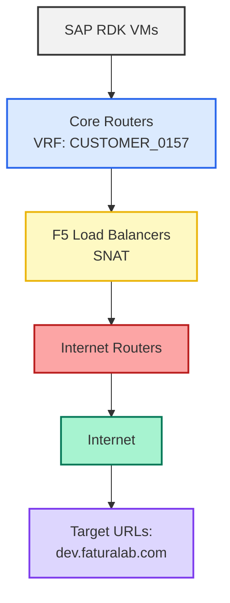

# SAP Outbound Internet Connectivity Validation – HEC01-RDK (Dev / Prod)

## Initial Request: SCTASK2720075 - Allowlist SAP Load Balancer access: OUTBOUND to EXTERNAL (Internet)

```java
Task: MANAGE REMOTE CONNECTION BETWEEN THE HOSTED SYSTEM LANDSCAPE AND SAPS SUPPORT INFRASTRUCTURE

Service Attributes:
 → ServiceNow Requested Item Number: RITM2491716
 → Title: ECS - Allowlist SAP Load Balancer access: OUTBOUND to EXTERNAL destn
 → Category: ECS Infrastructure
 → Service Type: HECSR_STD
 → Task No: SCTASK2720055
 → RnR Identifier: INFRA_1.2.01
 → RnR Version: 07 2019
 → Delivery Unit: ECS
 → Estimated Hours: 1 Hour
 → Delivery Instructions: Please create ticket with network team for allowlist the IPs mentioned by customer
 → Downtime / schedule: 
Downtime Start: 2026-01-09 01:29:10 UTC
Estimated End: 2026-01-09 02:29:10 UTC

 → List of Service Parameters: 
   → Customer ID: RDK
   → Primary/DR/Both Primary and DR ?: Primary
   → SAP-Datacenter where Landscape is deployed: HEC09 (Germany, St. Leon-Rot 2) 
   → Is this request for non HTTP / HTTPS Port ?: Yes
   → Source IP/URL: --Dev---
vhrdkbsdci.rot.sap.sarper.com / 192.168.50.29
vhrdkbsdcs.rot.sap.sarper.com / 192.168.50.30
vhrdkbsddb.rot.sap.sarper.com / 192.168.50.31
---Prod---
vhrdkbspcs.rot.sap.sarper.com / 192.168.50.26
vhrdkbspdb.rot.sap.sarper.com / 192.168.50.36
vhrdkbspci.rot.sap.sarper.com / 192.168.50.27
   → Target IP/URL: dev.faturalab.com/api/sap & IP : 90.158.5.106,www.faturalab.com/api/sap IP : 90.158.109.190
   → Target Port Number: 9081
   → Additional Information: Hi,
Please provide the access from the development source 29,30,31 to dev.faturalab so on. For prod. 26,36 and 27 should be www.faturalab.com so on.
```

## 1. Objective

This document details the validation steps, configuration breakdown, and analysis for outbound Internet connectivity from **HEC01 SAP Dev/Prod servers** to the following public endpoints.

**Source (Host/IP):**

- **DEV:**
  - vhrdkbsdci.rot.sap.sarper.com / 192.168.50.29
  - vhrdkbsdcs.rot.sap.sarper.com / 192.168.50.30
  - vhrdkbsddb.rot.sap.sarper.com / 192.168.50.31

- **PROD:**
  - vhrdkbspcs.rot.sap.sarper.com / 192.168.50.26
  - vhrdkbspdb.rot.sap.sarper.com / 192.168.50.36
  - vhrdkbspci.rot.sap.sarper.com / 192.168.50.27

<br>

| Target URL (INTERNET)              | Destination IP    | Port | Protocol |
|---------------------------- |------------------|------|----------|
| dev.faturalab.com/api/sap   | 90.158.5.106     | 9081 | TCP      |
| www.faturalab.com/api/sap   | 90.158.109.190   | 9081 | TCP      |

---

## 2. Expected Network Flow

Outbound traffic from SAP VMs is expected to traverse the following path:




**Why this matters:**  
Each hop is a potential failure point. Verifying each ensures the SAP network is not the source of the issue.

---

## 3. Network Configuration Breakdown & Validation

### 3.1 Core Routers – Default Route

**Config:**
```java
rt-hec01-ha-core-01a# show ip route vrf CUSTOMER_0157 0.0.0.0

VRF: CUSTOMER_0157
Gateway of last resort:
S 0.0.0.0/0 [1/0] via 192.168.50.249, Vlan2157
```

**Purpose:**  
Ensures all outbound traffic from SAP VMs is routed towards the F5 Load Balancer.

**Validation:**  
Presence of the default route confirms correct routing.  
**Output proves:** Traffic can exit SAP VMs towards the Internet.

---

### 3.2 F5 Load Balancer – Internet Outbound Configuration

**Config:**
```java
ltm virtual CUST0157_HEC01_RDK_Internet_Gateway_iApp {
   destination 0.0.0.0%2157:0
   ip-forward
   source 0.0.0.0%2157/0
   source-address-translation {
      pool CUST0157_HEC01_RDK_Internet_Gateway_iApp
      type snat
   }
   rules {
      CUST0157_HEC01_RDK_Internet_Gateway_iApp_v04
   }
}
```
**SNAT Pool:**
```java
ltm snatpool CUST0157_HEC01_RDK_Internet_Gateway_iApp {
   members {
      157.133.120.160
   }
}
```

**Purpose:**  
- The virtual server forwards all outbound traffic.
- SNAT (Source NAT) rewrites the source IP to the public SAP IP (`157.133.120.160`).

**Validation:**  
Configuration ensures SAP traffic appears to originate from the correct public IP.  
**Output proves:** Outbound traffic is NATed as required for Internet access.

---

### 3.3 Destination Allow Lists (Domains & IPs)

**Config:**
- **Domain-based:**  
  - dev.faturalab.com, port 9081  
  - www.faturalab.com, port 9081
- **IP-based:**  
  - 90.158.5.106/32, port 9081  
  - 90.158.109.190/32, port 9081

```java
c5411544@(lb-hec01-02)(cfg-sync Changes Pending)(Active)(/Common)(tmos)# list ltm data-group internal CUST0157_HEC01_RDK_Internet_Gateway_dst_ips_iApp CUST0157_HEC01_RDK_Internet_Gateway_dst_domains_iApp
ltm data-group internal CUST0157_HEC01_RDK_Internet_Gateway_dst_domains_iApp {
    app-service /Common/CUST0157_HEC01_RDK_Internet_Gateway.app/CUST0157_HEC01_RDK_Internet_Gateway
    records {
        192.168.50.0%2157/24 {
            data "{bitbucket.org 6 0} {panorama.sarper.com 6 0} {smtp.office365.com 6 0} {outlook.office365.com 6 0} {ooc-g2.tm-4.office.com 6 0} {outlook.ms-acdc.office.com 6 0} {vie-efz.ms-acdc.office.com 6 0} {FRA-efz.ms-acdc.office.com 6 0} {api.migros.com.tr 6 8083} {filebox.teb.com.tr 6 0} {dev.faturalab.com 6 9081} {www.faturalab.com 6 9081}"
        }
    }
    type ip
}
ltm data-group internal CUST0157_HEC01_RDK_Internet_Gateway_dst_ips_iApp {
    app-service /Common/CUST0157_HEC01_RDK_Internet_Gateway.app/CUST0157_HEC01_RDK_Internet_Gateway
    records {
        192.168.50.0%2157/24 {
            data "{40.115.57.8/32 6 0} {217.68.215.20/32 6 0} {213.148.65.208/32 6 0} {13.107.6.152/31 6 587} {13.107.18.10/31 6 587} {13.107.128.0/22 6 587} {23.103.160.0/20 6 587} {40.96.0.0/13 6 587} {40.104.0.0/15 6 587} {52.96.0.0/14 6 587} {131.253.33.215/32 6 587} {132.245.0.0/16 6 587} {150.171.32.0/22 6 587} {204.79.197.215/32 6 587} {4.180.75.122/32 6 1433} {90.158.5.106/32 6 9081} {90.158.109.190/32 6 9081}"
        }
        192.168.50.252%2157/32 {
            data "{0.0.0.0/0 6 0}"
        }
        192.168.50.253%2157/32 {
            data "{0.0.0.0/0 6 0}"
        }
    }
    type ip
}
```

**Purpose:**  
Allows only specific domains and IPs for outbound connections, enforcing security.

**Validation:**  
Entries confirm that required destinations are permitted.  
**Output proves:** No policy blocks SAP traffic to the target endpoints.

---

### 3.4 Internet Router – Return Traffic ACL

**Config:**
```java
rt-hec01-inet-02a# sh ip access-list 100 | i 90.158.5.106
2390 permit tcp host 90.158.5.106 eq 9081 host 157.133.120.160 gt 1023 established
```

**Purpose:**  
Allows return traffic from the destination back to the SAP public IP for established sessions.

**Validation:**  
ACL entry ensures responses from the Internet can reach SAP.  
**Output proves:** No firewall blocks return packets.

---

## 4. SAP Server Validation

**Source Server:**  
- Host: hec01v069237  
- Virtual IPs: 192.168.50.29, 192.168.50.30

**Test:**
```sh
telnet dev.faturalab.com 9081
```
**Result:**
```java
Trying 90.158.5.106...
Connection refused
```

**Purpose:**  
Tests end-to-end connectivity from SAP VM to the destination.

**Validation:**  
Connection reaches the destination, but is refused at the application level.  
**Output proves:** Network path is functional up to the destination.

---

## 5. Packet Capture Analysis (F5 Load Balancer)

**tcpdump Output:**
```java
21:10:05.695780 IP 192.168.50.28.38858 > 90.158.5.106.9081: Flags [S]
21:10:05.695957 IP 157.133.120.160.38858 > 90.158.5.106.9081: Flags [S]
21:10:05.771564 IP 90.158.5.106.9081 > 157.133.120.160.38858: Flags [R.]
21:10:05.771570 IP 90.158.5.106.9081 > 192.168.50.28.38858: Flags [R.]
```

**Explanation:**  
- SAP server sends SYN (connection request).
- F5 SNATs the source IP to 157.133.120.160.
- Destination responds with TCP RESET (R), refusing the connection.

**Validation:**  
Confirms traffic leaves SAP, is NATed, and reaches the destination.  
**Output proves:** The network delivers packets as expected; the destination actively refuses the connection.

---

## 6. Root Cause Analysis
| Layer              | Status     |
|--------------------|------------|
| SAP VM             | <span style="color:darkorange">Sending</span>    |
| Core Routing       | <span style="color:green">Working</span>    |
| F5 SNAT            | <span style="color:green">Working</span>    |
| Internet Router ACL| <span style="color:green">Working</span>    |
| Internet Path      | <span style="color:green">Working</span>    |
| Destination Server | <span style="color:red">Resetting connections</span> |

<span style="color:royalblue"><b>Conclusion:</b></span>  
All SAP-side network components are correctly configured and operational. The destination server is actively rejecting connections, indicating:
- IP-based access restriction
- Missing whitelist entry
- Application-level security policy
- Service not listening on TCP/9081 for this source IP

---

## 7. Final Conclusion & Next Actions

**Network & LB Team Conclusion:**  
- Outbound traffic is NATed and routed correctly.
- Packets reach the destination.
- Connection failure occurs outside the SAP network.

**Required Action (Customer / Application Team):**  
Request the customer/destination team to whitelist the SAP public outbound IP (`157.133.120.160`) on TCP port 9081.

Once whitelisting is completed, connectivity should work without further network changes, from SAP side at least.

---

## 8. Ownership

**HEC Data & Load Balancer Teams:**  
- Configuration validated  
- Traffic verified  
- Issue confirmed outside SAP HEC DC boundary
