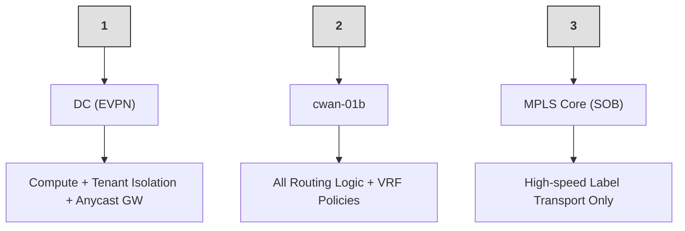

```mermaid
%% Mermaid table-like grid
flowchart TB
    classDef header fill:#e0e0e0,stroke:#000,font-weight:bold;

    SL1["1"]:::header --> D1["DC (EVPN)"] --> R1["Compute + Tenant Isolation + Anycast GW"]
    SL2["2"]:::header --> D2["cwan-01b"] --> R2["All Routing Logic + VRF Policies"]
    SL3["3"]:::header --> D3["MPLS Core (SOB)"] --> R3["High‑speed Label Transport Only"]

```
