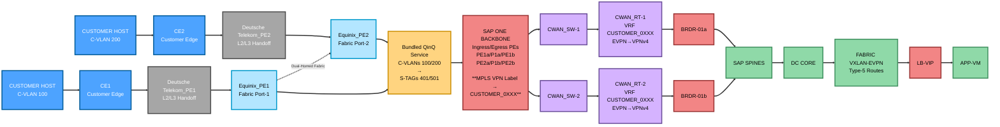

```mermaid
flowchart LR

%% ===========================
%% Global Styling for Big Diagram
%% ===========================
classDef big stroke-width:4px, font-size:22px, padding:25px;

classDef customer fill:#4DA3FF,stroke:#005B99,color:#fff,stroke-width:4px,font-size:22px,padding:25px;
classDef telco fill:#A6A6A6,stroke:#4D4D4D,color:#fff,stroke-width:4px,font-size:22px,padding:25px;
classDef interco fill:#B3E6FF,stroke:#0099CC,color:#000,stroke-width:4px,font-size:22px,padding:25px;
classDef qinq fill:#FFD480,stroke:#CC8E00,color:#000,stroke-width:4px,font-size:22px,padding:25px;
classDef sap fill:#F28585,stroke:#993333,color:#000,stroke-width:4px,font-size:22px,padding:25px;
classDef cwan fill:#D5B3FF,stroke:#6A4D99,color:#000,stroke-width:4px,font-size:22px,padding:25px;
classDef core fill:#8FD9A8,stroke:#3F8F5E,color:#000,stroke-width:4px,font-size:22px,padding:25px;

linkStyle default stroke-width:4px;

%% ================================================================
%% VLAN 100 → 401   AND   VLAN 200 → 501  (Horizontal view)
%% ================================================================

%% LEFT: CUSTOMER
H1[CUSTOMER HOST<br/>C‑VLAN 100]:::customer
H2[CUSTOMER HOST<br/>C‑VLAN 200]:::customer

H1 --> CE1[CE1<br/>Customer Edge]:::customer
H2 --> CE2[CE2<br/>Customer Edge]:::customer

%% TELCO
CE1 --> DT1[Deutsche Telekom_PE1<br/>L2/L3 Handoff]:::telco
CE2 --> DT2[Deutsche Telekom_PE2<br/>L2/L3 Handoff]:::telco

%% INTERCONNECT (Dual-Homed)
DT1 --> EQ1[Equinix_PE1<br/>Fabric Port‑1]:::interco
DT2 --> EQ2[Equinix_PE2<br/>Fabric Port‑2]:::interco

%% CROSS-CONNECT — Dual active paths
EQ1 -. Dual‑Homed Fabric .-> EQ2

%% QINQ Mapping
EQ1 --> Q1["Bundled QinQ Service<br/>C‑VLANs 100/200<br/>→<br/>S‑TAGs 401/501"]:::qinq
EQ2 --> Q1

%% SAP ONE BACKBONE
Q1 --> SOB["SAP ONE BACKBONE<br/>Ingress/Egress PEs<br/>PE1a/P1a/PE1b<br/>PE2a/P1b/PE2b<br/><br/>**MPLS VPN Label → CUSTOMER_0XXX**"]:::sap

%% CWAN SWITCHES
SOB --> SW1["CWAN_SW‑1"]:::cwan
SOB --> SW2["CWAN_SW‑2"]:::cwan

%% CWAN ROUTERS
SW1 --> RT1["CWAN_RT‑1<br/>VRF CUSTOMER_0XXX<br/>EVPN→VPNv4"]:::cwan
SW2 --> RT2["CWAN_RT‑2<br/>VRF CUSTOMER_0XXX<br/>EVPN→VPNv4"]:::cwan

%% BORDER ROUTERS
RT1 --> BR1[BRDR‑01a]:::sap
RT2 --> BR2[BRDR‑01b]:::sap

%% SAP FABRIC (Common)
BR1 --> SP[SAP SPINES]:::core
BR2 --> SP

SP --> CR[DC CORE]:::core
CR --> FAB[FABRIC VXLAN‑EVPN<br/>Type‑5 Routes]:::core

FAB --> VIP["LB‑VIP"]:::sap
VIP --> APP["APP‑VM"]:::core

```
